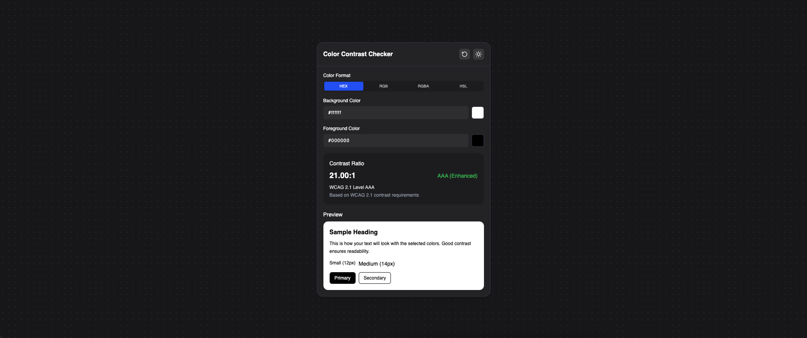
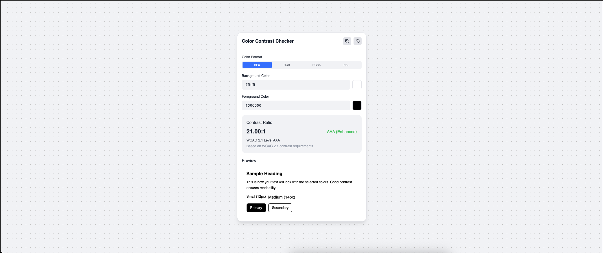

# Color Contrast Checker

A modern, accessible color contrast checker tool that helps designers and developers ensure their color combinations meet WCAG accessibility standards.



## Features

- Real-time contrast ratio calculation according to WCAG 2.1 guidelines
- Support for multiple color formats (HEX, RGB, RGBA, HSL)
- Visual preview of text and UI elements with selected colors
- Light and dark theme support
- WCAG compliance indicators (AA, AAA standards)
- Responsive design for desktop and mobile

## Tech Stack

- **React** - UI library
- **TypeScript** - Type-safe JavaScript
- **Tailwind CSS** - Utility-first CSS framework
- **Headless UI** - Unstyled, accessible UI components
- **Zustand** - State management
- **Motion** - Animation library
- **Vite** - Build tool and development server

## Screenshots

### Dark Mode


### Light Mode



## Installation

Clone the repository and install dependencies:

```bash
git clone https://github.com/yourusername/color-contrast-checker.git
cd color-contrast-checker
npm install
npm run dev
```
